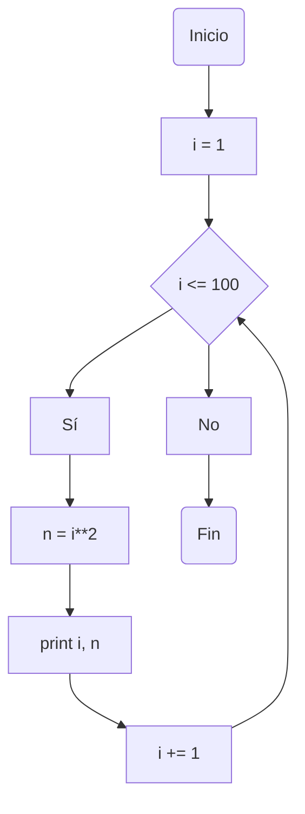
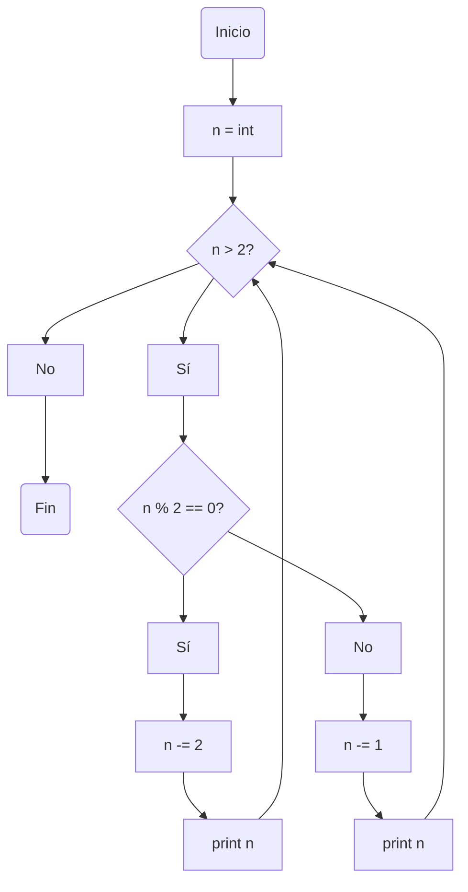

# reto_7

Todos los puntos de este taller se encuentran en un cuaderno de Google Colab en el siguiente enlace: https://colab.research.google.com/drive/1tO5AWjg1vv9E60scXiJL5gydZBrHEpQs

### Punto 1

Imprimir un listado con los números del 1 al 100 cada uno con su respectivo cuadrado.

```python
i : int = 0
while i < 100:
    i += 1
    print(i, i**2)
```
* Explicación:

Se defina una única variablela cual será igual a cero. Seguido a esto, en un ciclo while ponemos el bucle a partir de la variable 'i' para que llegue hasta 100, y al lado el mismo bucle pero con la variable elevada al cuadrado.

* Diagrama de flujo:



### Punto 2

Imprimir un listado con los números impares desde 1 hasta 999 y seguidamente otro listado con los números pares desde 2 hasta 1000.

```python
i : int = 0
j : int = -1
while i < 1000 and j < 999:
    i += 2
    j += 2
    print(j, i)
```

* Explicación:

  Se definen dos variables, la primera igual a cero y en un bucle que va sumando 2 unidades para imprimir los números pares hasta 1000, y la segunda con valor de -1 y el mismo bucle aumentando 2 unidades hasta 999 para imprimir los números impares.

* Diagrama de flujo:

```mermaid
flowchart TD;
    A(Inicio) --> B["i = 2 and j = 1"] --> C{"i <= 1000 and j <= 999"} --> D["Sí"]
    C --> E["No"]
    D --> F["print i, j"] --> G["i += 2"] --> H["j += 2"] --> C
    E --> I(Fin)
````

### Punto 3

Imprimir los números pares en forma descendente hasta 2 que son menores o iguales a un número natural n ≥ 2 dado

```python
n : int
n = int(input("Ingrese un número natural mayor o igual a 2: "))
print("La lista de números pares anteriores a " +str(n)+ " es:")
while n > 2:
    if n % 2 == 0:
        n -= 2
    else:
        n = n +1
        n -= 2
    print(n)
```

* Explicación:

Se define una variable que será para que el usuario ingrese un valor numérico natural entre 2 hasta infinito. Seguido a esto, se define un bucle cuando la variable 'n' sea mayor que 2, indicándole al programa que si el cociente entre la variable y 2 es cero, significa que el número ingresado es par, por lo tanto basta con restar 2 unidades hasta llegar al 2. Si el cociente entre la variable 'n' y 2 es diferente de cero, quiere decir que el número es impar, por lo cual a la variable se le resta una unidad y a partir de allí inicia el mismo ciclo.

* Diagrama de flujo:



### Punto 4

En 2022 el país A tendrá una población de 25 millones de habitantes y el país B de 18.9 millones. Las tasas de crecimiento anual de la población serán de 2% y 3% respectivamente. Desarrollar un algoritmo para informar en que año la población del país B superará a la de A.

```python
A : float = 25
B : float = 18.9
C : float = 2022
while A > B:
    crecA = 1 + 0.02
    crecB = 1 + 0.03
    A *= crecA
    B *= crecB
    C += 1
print("En el año " +str(C)+ " la población del país B será mayor que la población del país A")
```

* Explicación:

Se definen tres variables, una de las cuales corresponde a la población actual del país A en millones, la segunda corresponde a la población actual del país B, y la tercera corresponde al año 2022. En un ciclo while definimos dos variables más, que corresponden a la tasa de crecimiento de cada uno de los dos países, en este caso de 0,2% para el país A y o,3% para el país B. El ciclo para cuando la variable que correspondía a la población del país B sea mayor que la población del país A, o mientras la población del país A sea mayor que la población del país B. Cuando termine el ciclo, la variable correspondiente al año en que estamos se incrementa en una unidad y el programa arroja el año que haya resultado una vez finalizado el ciclo.

### Punto 5

Imprimir el factorial de un número natural n dado.

```python
m : int = 1
n : int = int(input("Introduzca un número natural: "))
i : int = 1
while (i <= n):
    m *= i
    i += 1
print (str(n) + " factorial es igual a " +str(m))
```

* Explicación:

Se definen 3 variables, una de las cuales corresponde al número que va a digitar el usuario y otras dos con valor de 1 unidad. El ciclo while se mantiene mientras la variable 'i' que vale uno sea menor o igual al número digitado por el usuario, de manera que la tercera variable que es 1 se multiplica por la variable 'i' mienras esta misma va aumentando en una unidad hasta llegar al valor de 'n'.

### Punto 6

Implementar un algoritmo que permita adivinar un número dado de 1 a 100, preguntando en cada caso si el número es mayor, menor o igual.

```python
import random
def adivinar():
    print("Piense en un número de 1 a 100")
    min = 1
    max = 100
    while True: 
        n = random.randint(min, max) 
        print("¿Su número es " + str(n)+ "?")
        print("(Responda 'igual' si es correcto, 'menor' si es menor o 'mayor' si es mayor): ")
        respuesta = input()
        if respuesta == 'igual':
            print("Adiviné")
            break
        elif respuesta == 'menor':
            max = n - 1
        elif respuesta == 'mayor':
            min = n + 1
        else:
            print("Yo no le di esa opción, ahora por irse de avión le tocó iniciar otra vez")
            break
adivinar()
```

* Explicación:

Para realizar este programa usé la función random que sirve para generar números aleatorios en un rango de 1 hasta 100 definido por mí, de manera que si el usuario responde que su número es mayor que el número generado, entonces el mínimo del rango aumenta en una unidad respecto al número dado, y si es menor, el máximo disminuye en una unidad respecto al número dado, hasta que se llegue al número que pensó el usuario.

### Punto 7

Implementar un programa que ingrese un número de 2 a 50 y muestre sus divisores.

```python
a : int
a = int(input("Ingrese un número de 2 a 50:"))
b : int = a
c : int = a
print("Los divisores de " +str(c)+ " son:")
while b >= 1:
    if a % b == 0:
        print(b)
    b -= 1
```

* Explicación:

Se definen 3 variables, una de las cuales corresponde al número que va a ingresar el usuario en un rango de 2 a 50, la segunda es igual al número que proporcione el usuario al igual que la última. El ciclo empieza y se mantiene mientras que la seghunda variable sea mayor o igual que 1, de manera que si el cociente entre la primera variable y la segunda es igual a 0, significa que este es un divisor, y se va a imprimir ese número, caso contrario no se va a imprimir, y la segunda variable disminuirá en una unidad cada vez. La tercera variable la utilizo sólo para general un mensaje y que quede más bonito.

### Punto 8

Implementar el algoritmo que muestre los números primos del 1 al 100. Nota: use funciones

```python
def es_primo(a):
    if a < 2:
        return False
    for i in range(2, a):
        if a % i == 0:
            return False
    return True
for a in range(1, 101):
    if es_primo(a):
        print(a)
```

* Explicación:

Para este punto, definí una función que consiste en decir que si a es menor que 2, retorne un booleano falso y para una variable 'i' en el rango de 2 hasta a, si el cociente entre 'a' e 'i' es igual a cero, retorne también un booleano falso. Al final la función tiene que retornar un booleano verdadero.
Al final utilizo la función en un rango de 1 hasta 101 para que tome el 1 hasta 100.


